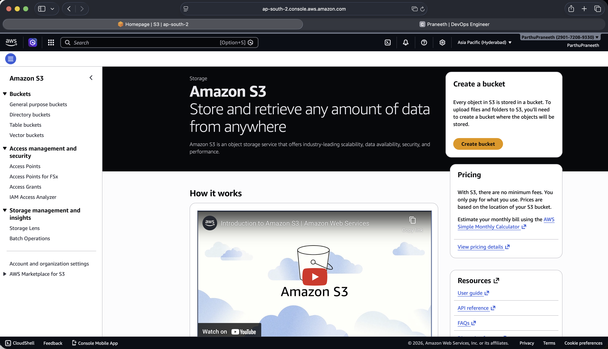
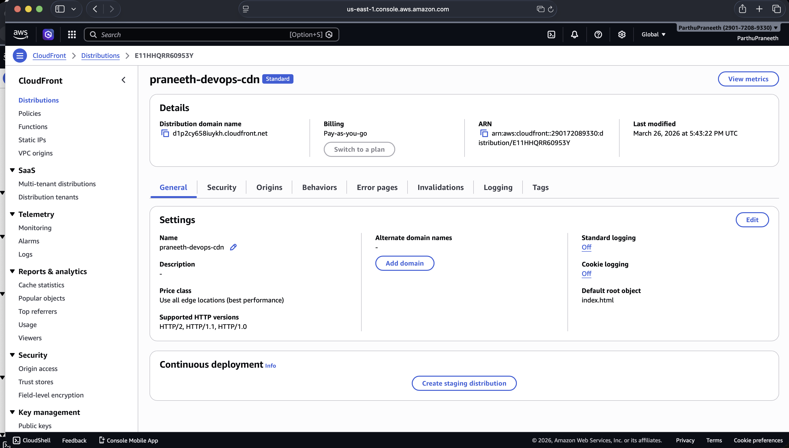

# 🚀 Production-Ready Static Website on AWS (S3 + CloudFront)

## 📌 Overview

This project demonstrates a **production-grade static website deployment** using AWS services with a focus on **security, scalability, and performance**.

The architecture ensures:

* No public access to storage (S3 is private)
* Secure content delivery via CloudFront CDN
* Low-latency global access
* Proper DevOps deployment workflow

---

## 🧠 Architecture

```
User (Browser)
      ↓ HTTPS
CloudFront (CDN)
      ↓ OAC (Secure Access)
S3 Bucket (Private)
      ↓
IAM Policies (Access Control)
```

---

## ⚙️ Tech Stack

| Service                     | Purpose                                 |
| --------------------------- | --------------------------------------- |
| AWS S3                      | Stores static website files (HTML, CSS) |
| CloudFront                  | CDN for fast global delivery            |
| OAC (Origin Access Control) | Restricts direct S3 access              |
| IAM                         | Secure permission management            |
| VS Code                     | Development                             |
| GitHub                      | Code + proof of deployment              |

---

## 🔐 Security Features

* ✅ S3 bucket is **completely private**
* ✅ Public access is **blocked**
* ✅ Only CloudFront can access S3 (via OAC)
* ✅ HTTPS enforced using CloudFront
* ❌ No direct S3 URL access (returns 403)

---

## 🚀 Deployment Steps

### 1. Create S3 Bucket

* Block all public access
* Upload `index.html`

### 2. Create CloudFront Distribution

* Connect S3 as origin
* Enable private access (OAC)
* Set default root object:

  ```
  index.html
  ```

### 3. Access Website

```
https://<cloudfront-domain>.cloudfront.net
```

---

## 🔄 Updating Website (DevOps Flow)

```
Edit code → Upload to S3 → Invalidate CloudFront → Live
```

### Steps:

1. Update `index.html`
2. Upload to S3 (overwrite)
3. Go to CloudFront → Invalidations
4. Create:

   ```
   /*
   ```

---

## 📸 Screenshots

### S3 Bucket



### Uploaded File


### CloudFront Distribution



### Live Website


---

## 🌐 Live Demo

👉 https://<your-cloudfront-url>

---

## 💡 Key Learnings

* How CDN caching works
* Difference between public vs private storage
* Secure architecture design using OAC
* Real-world deployment workflow
* Cache invalidation importance

---

## ⚠️ Common Issues & Fixes

### Access Denied

* Fix: Set default root object → `index.html`

### Changes not reflecting

* Fix: Create CloudFront invalidation (`/*`)

---

## 🎯 Why This Project Matters

This is NOT a basic hosting project.

It demonstrates:

* ✔ Real DevOps workflow
* ✔ Cloud architecture understanding
* ✔ Security best practices
* ✔ Production-ready mindset

---

## 🔥 Future Improvements

* CI/CD using GitHub Actions
* Custom domain with Route53
* HTTPS certificate (ACM)
* Docker-based deployment

---

## 👨‍💻 Author

**Partha Praneeth Reddy **
DevOps Enthusiast | Cloud Learner

---
